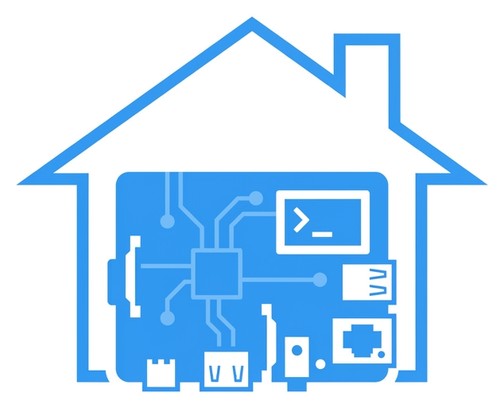
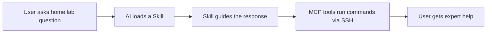

<p align="center">
  
</p>

<h1 align="center">Home Lab Developer Tools</h1>

<p align="center">
  Home lab and Raspberry Pi workflows for Cursor, Claude Code, and any MCP-compatible editor.
</p>

<p align="center">
  <a href="https://github.com/TMHSDigital/Home-Lab-Developer-Tools/releases"></a>
  <a href="https://github.com/TMHSDigital/Home-Lab-Developer-Tools/releases"></a>
  <a href="https://www.npmjs.com/package/@tmhs/homelab-mcp"></a>
  <a href="LICENSE"></a>
  <a href="https://tmhsdigital.github.io/Home-Lab-Developer-Tools/"></a>
</p>

<p align="center">
  <a href="https://github.com/TMHSDigital/Home-Lab-Developer-Tools/actions"></a>
  <a href="https://github.com/TMHSDigital/Home-Lab-Developer-Tools/actions"></a>
</p>

<p align="center">
  
  
  
  
</p>

<p align="center">
  <strong>15 skills &nbsp;&bull;&nbsp; 7 rules &nbsp;&bull;&nbsp; 29 MCP tools</strong>
</p>

---

## Compatibility

This project works with any AI coding tool that supports skills, rules, or MCP:

| Component | Cursor | Claude Code (terminal) | Claude Code in Cursor | Other MCP clients |
|---|:---:|:---:|:---:|:---:|
| **CLAUDE.md** context | Yes | Yes | Yes | - |
| **15 Skills** (SKILL.md) | Yes | Yes | Yes | - |
| **7 Rules** (.mdc) | Yes | Via CLAUDE.md | Yes | - |
| **29 MCP tools** | Yes | Yes | Yes | Yes |

> **Claude Code** reads `CLAUDE.md` automatically and can reference skills. The MCP server works with any client that supports the MCP stdio transport.

## Quick Start

Install the plugin, then ask anything about your home lab:

```text
"What's the CPU temperature on my Pi?"
"Restart the Grafana container"
"Show me which services are unhealthy"
"Pull latest images and redeploy the monitoring stack"
```

## How It Works



---

<details>
<summary><strong>15 Skills</strong> - on-demand home lab expertise</summary>

&nbsp;

| Category | Skill | Description |
|---|---|---|
| **System** | `pi-system-management` | Monitor Pi hardware -- temp, throttling, memory, reboots |
| **Containers** | `docker-compose-stacks` | Manage multi-file Docker Compose deployments |
| **Monitoring** | `service-monitoring` | Prometheus, Grafana, Uptime Kuma, alert rules |
| **Monitoring** | `grafana-dashboards` | Create, import, and manage Grafana dashboards |
| **Monitoring** | `alerting-rules` | Prometheus alerting rules and Alertmanager routing |
| **Network** | `network-configuration` | AdGuard DNS, NPM reverse proxy, Tailscale VPN |
| **Network** | `dns-management` | AdGuard filters, local DNS records, blocklists |
| **Network** | `reverse-proxy-management` | NPM routing, SSL config, access lists |
| **Backup** | `backup-recovery` | Restic backup config, scheduling, and restore |
| **Backup** | `disaster-recovery` | Full Pi restore, SD card imaging, migration checklist |
| **SSH** | `ssh-management` | SSH keys, hardening, tunnels, troubleshooting |
| **Automation** | `ansible-workflows` | Ansible playbooks for multi-node management |
| **Security** | `security-hardening` | UFW, fail2ban, SSH lockdown, container security |
| **Storage** | `storage-management` | Samba, Syncthing, volumes, disk monitoring |
| **Debug** | `troubleshooting` | Debug crashes, network issues, hardware problems |

</details>

<details>
<summary><strong>7 Rules</strong> - automatic best-practice enforcement</summary>

&nbsp;

| Rule | Scope | What It Does |
|---|---|---|
| `homelab-secrets` | Global (always active) | Flag hardcoded passwords, IPs, and SSH keys |
| `compose-arm64` | Compose files | Flag images without arm64 support, missing healthchecks |
| `ssh-safety` | Global (always active) | Flag dangerous SSH commands (rm -rf, dd, mkfs) |
| `yaml-conventions` | YAML files | Enforce 2-space indent, document start, explicit booleans |
| `ansible-best-practices` | Ansible files | Flag non-FQCN modules, missing tags, shell misuse |
| `exposed-ports` | Compose files | Flag services with exposed host ports that should use a reverse proxy |
| `backup-coverage` | Compose files | Flag Docker volumes not covered by any backup job |

</details>

---

## Companion: Home Lab MCP Server

The MCP server gives your AI assistant live access to your Raspberry Pi via SSH. Works with Cursor, Claude Code, and any MCP-compatible client.

<p align="center">
  
  
  
  
</p>

Add to your Cursor MCP config (`.cursor/mcp.json`):

```json
{
  "mcpServers": {
    "homelab": {
      "command": "node",
      "args": ["./mcp-server/dist/index.js"],
      "cwd": "<path-to>/Home-Lab-Developer-Tools",
      "env": {
        "HOMELAB_PI_HOST": "raspi5.local",
        "HOMELAB_PI_USER": "tmhs",
        "HOMELAB_PI_KEY_PATH": "~/.ssh/id_ed25519_pi"
      }
    }
  }
}
```

<details>
<summary><strong>29 MCP Tools</strong> - full tool reference</summary>

&nbsp;

**System** (4)

| Tool | What It Does |
|---|---|
| `homelab_piStatus` | CPU temp, memory, disk, uptime, throttle state |
| `homelab_piReboot` | Safe reboot with pre-checks (requires confirm=true) |
| `homelab_diskUsage` | Disk usage breakdown by directory |
| `homelab_aptUpdate` | Run apt update, list upgradable packages |

**Containers** (3)

| Tool | What It Does |
|---|---|
| `homelab_serviceHealth` | Docker container health status |
| `homelab_serviceLogs` | Tail container logs |
| `homelab_serviceRestart` | Restart a container |

**Compose** (4)

| Tool | What It Does |
|---|---|
| `homelab_composeUp` | Start compose stacks (all or specific) |
| `homelab_composeDown` | Stop compose stacks |
| `homelab_composePull` | Pull latest images |
| `homelab_composePs` | List running compose containers |

**Monitoring** (5)

| Tool | What It Does |
|---|---|
| `homelab_prometheusQuery` | Run a PromQL query against Prometheus |
| `homelab_grafanaSnapshot` | Export a Grafana dashboard configuration by UID |
| `homelab_uptimeKumaStatus` | Get the status of all Uptime Kuma monitors |
| `homelab_alertList` | List alerts from Alertmanager by state |
| `homelab_speedtestResults` | Get recent Speedtest Tracker results |

**DNS / Proxy** (5)

| Tool | What It Does |
|---|---|
| `homelab_adguardStats` | AdGuard Home DNS statistics and top blocked domains |
| `homelab_adguardFilters` | List AdGuard filter/blocklists and status |
| `homelab_adguardQueryLog` | Search the AdGuard DNS query log |
| `homelab_npmProxyHosts` | List NPM proxy host configurations |
| `homelab_npmCerts` | List SSL certificates and expiry dates |

**Network** (1)

| Tool | What It Does |
|---|---|
| `homelab_networkInfo` | IP addresses, DNS, Tailscale status |

**Backup** (6)

| Tool | What It Does |
|---|---|
| `homelab_backupStatus` | Check latest restic snapshots |
| `homelab_backupRun` | Trigger restic backup (requires confirm=true) |
| `homelab_backupList` | List all restic snapshots with path, tag, host filtering |
| `homelab_backupRestore` | Restore files from a snapshot (requires confirm=true) |
| `homelab_backupDiff` | Show differences between two snapshots |
| `homelab_volumeBackup` | Back up a Docker volume to restic (requires confirm=true) |

**SSH** (1)

| Tool | What It Does |
|---|---|
| `homelab_sshTest` | Test SSH connectivity |

</details>

---

<details>
<summary><h2>Installation</h2></summary>

&nbsp;

### Cursor (plugin + MCP)

Symlink this repo into your Cursor plugins directory:

```powershell
# Windows (PowerShell - run as admin)
New-Item -ItemType SymbolicLink `
  -Path "$env:USERPROFILE\.cursor\plugins\home-lab-developer-tools" `
  -Target "<path-to>\Home-Lab-Developer-Tools"
```

```bash
# macOS / Linux
ln -s /path/to/Home-Lab-Developer-Tools ~/.cursor/plugins/home-lab-developer-tools
```

Build and configure the MCP server:

```bash
cd mcp-server
npm install
npm run build
```

Then add the JSON config from the [MCP Server section](#companion-home-lab-mcp-server) to `.cursor/mcp.json`.

### Claude Code (terminal or in Cursor)

Claude Code reads `CLAUDE.md` automatically when you open this repo. For the MCP server, register it with:

```bash
cd mcp-server && npm install && npm run build
claude mcp add homelab node ./mcp-server/dist/index.js
```

Or if installed globally via npm:

```bash
npm install -g @tmhs/homelab-mcp
claude mcp add homelab -- npx @tmhs/homelab-mcp
```

### Other MCP clients

Any client supporting MCP stdio transport can use the Home Lab MCP server. Point it at `node ./mcp-server/dist/index.js` or the global `npx @tmhs/homelab-mcp`.

</details>

<details>
<summary><h2>Example Prompts</h2> - one per skill</summary>

&nbsp;

| Skill | Try This |
|---|---|
| `pi-system-management` | "Is my Pi overheating? Check the CPU temp and throttle status" |
| `docker-compose-stacks` | "Pull latest images and redeploy the monitoring stack" |
| `service-monitoring` | "Set up a Prometheus alert for when disk usage exceeds 85%" |
| `network-configuration` | "Configure AdGuard to block ads for all devices on my network" |
| `backup-recovery` | "When was the last backup? Show me the recent snapshots" |
| `ssh-management` | "Harden my SSH config -- disable password auth, change the port" |
| `ansible-workflows` | "Write an Ansible playbook to deploy all compose stacks" |
| `security-hardening` | "Audit my Pi's firewall rules and suggest improvements" |
| `storage-management` | "Which directories are using the most disk space?" |
| `troubleshooting` | "Grafana won't start -- help me debug the container" |
| `grafana-dashboards` | "Export my main Pi dashboard from Grafana" |
| `alerting-rules` | "Set up an alert for when disk usage goes above 85%" |
| `dns-management` | "Why is example.com being blocked? Check the AdGuard query log" |
| `reverse-proxy-management` | "What services are proxied through NPM? Any certs expiring soon?" |
| `disaster-recovery` | "My Pi died. Walk me through restoring from the latest restic backup" |

</details>

<details>
<summary><h2>Roadmap</h2></summary>

&nbsp;

| Version | Theme | New Tools | New Skills | New Rules | Cumulative |
|---|---|---|---|---|---|
| **v0.1.0** | Foundation | 15 | 10 | 5 | 15 |
| **v0.2.0** | **Extended Monitoring** | **+5** | **+2** | **--** | **20** |
| **v0.3.0** | **DNS and Reverse Proxy** | **+5** | **+2** | **+1** | **25** |
| **v0.4.0** | **Backup and Recovery** | **+4** | **+1** | **+1** | **29** |
| v0.5.0 | Security Hardening | +4 | +1 | +2 | 33 |
| v0.6.0 | Logs and Notifications | +4 | +2 | -- | 37 |
| v0.7.0 | OS and Package Management | +4 | +2 | +1 | 41 |
| v0.8.0 | SSL/TLS Certificates | +3 | +1 | -- | 44 |
| v0.9.0 | Multi-Node Foundation | +4 | +1 | +1 | 48 |
| v0.10.0 | Testing Infrastructure | +2 | -- | -- | 50 |
| v0.11.0 | Documentation Site | -- | -- | -- | 50 |
| v0.12.0 | Polish and Hardening | +2 | -- | -- | 52 |
| **v1.0.0** | **Stable Release** | -- | -- | -- | **52** |

See [ROADMAP.md](ROADMAP.md) for detailed per-version tool, skill, and rule breakdowns.

</details>

---

## Related Projects

- [Home-Lab](https://github.com/TMHSDigital/Home-Lab) - The infrastructure repo this toolkit manages
- [raspi5-win-bootstrap](https://github.com/TMHSDigital/raspi5-win-bootstrap) - Day-0 Pi setup
- [Docker-Developer-Tools](https://github.com/TMHSDigital/Docker-Developer-Tools) - Docker workflows plugin (same structure)

## Contributing

Contributions welcome - see [CONTRIBUTING.md](CONTRIBUTING.md). Found a bug? [Open an issue](https://github.com/TMHSDigital/Home-Lab-Developer-Tools/issues).

## License

**CC-BY-NC-ND-4.0** - Copyright 2026 TM Hospitality Strategies. See [LICENSE](LICENSE).

<p align="center">
  <a href="https://github.com/TMHSDigital">Built by TMHSDigital</a>
</p>
